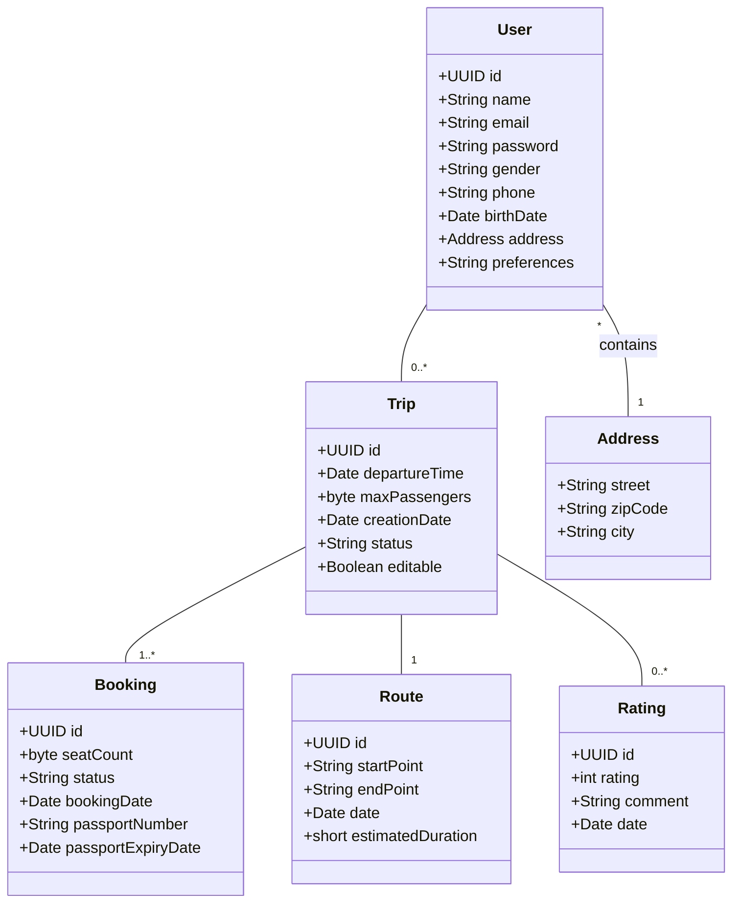
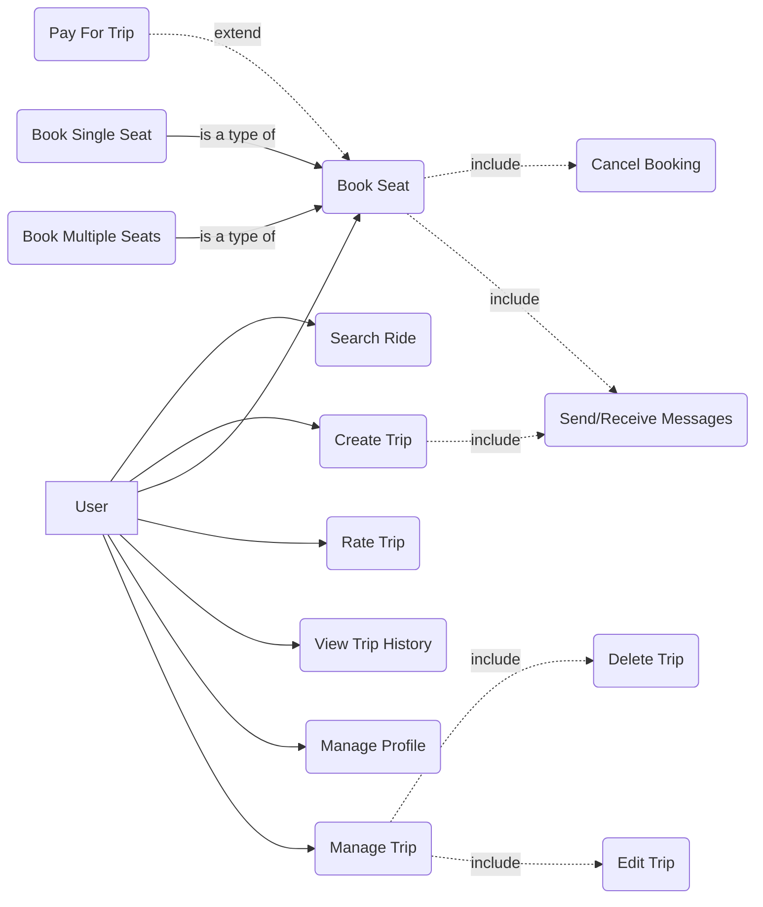
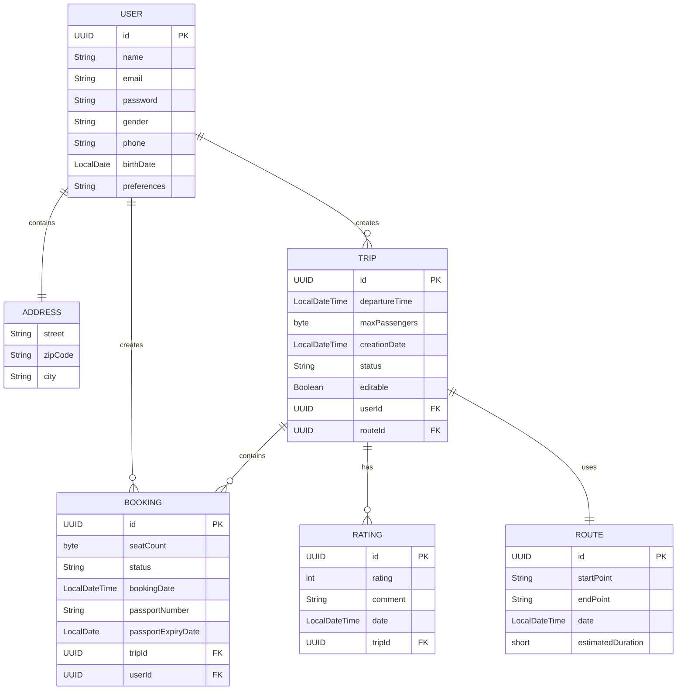

# CarPooling CLI - Приложение для совместных поездок

Это консольное приложение (CLI) позволяет пользователям регистрироваться, находить, создавать и управлять совместными поездками на автомобилях, а также бронировать места и оставлять оценки.

## Ключевые особенности

*   **Управление пользователями:** Регистрация и безопасная авторизация.
*   **Управление поездками:** Создание поездок с указанием маршрута, времени и количества мест.
*   **Бронирование:** Возможность для пользователей бронировать места в доступных поездках.
*   **Система оценок:** Пользователи могут оценивать завершенные поездки.
*   **Гибкое хранилище данных:** Поддержка различных бэкендов для хранения данных:
    *   XML файлы
    *   CSV файлы
    *   MongoDB
    *   PostgreSQL (с использованием Hibernate)
*   **Конфигурируемость:** Настройки приложения (пути к файлам, параметры БД) загружаются из внешних файлов (`environment.properties`, `.yaml`, `.xml`).
*   **Интерактивный режим:** Удобный режим для последовательного ввода команд.
*   **Сохранение настроек:** Тип хранилища и ID текущего пользователя сохраняются между сеансами (используя Java Preferences API).

## Технологический стек

*   **Язык:** Java 17+
*   **CLI Фреймворк:** Picocli
*   **Логирование:** SLF4j (с Log4j2 или другой реализацией)
*   **ORM (для PostgreSQL):** Hibernate
*   **Базы данных:** PostgreSQL, MongoDB
*   **Форматы данных:** XML (JAXB), CSV (OpenCSV), JSON (Jackson - для MongoDB)
*   **Конфигурация:** SnakeYAML (для YAML), Встроенные средства Java (для Properties, XML)
*   **Вспомогательные библиотеки:** Lombok
*   **Сборка:** Maven

## Необходимые условия

*   **JDK:** Версия 17 или выше.
*   **Maven:** Для сборки проекта.
*   **База данных (опционально):** Установленные и запущенные PostgreSQL и/или MongoDB, если планируется использовать соответствующие типы хранилищ.

## Конфигурация

*   **Основная конфигурация:** Настройки приложения (пути к файлам данных, параметры подключения к БД) находятся в файле `src/main/resources/environment.properties` (или `environment.yaml`/`environment.xml`). Путь к файлу конфигурации можно переопределить через системное свойство `config.file`.
*   **Конфигурация Hibernate:** Настройки для работы с PostgreSQL через Hibernate находятся в `src/main/resources/hibernate.cfg.xml`.

## Сборка проекта

Перейдите в корневую директорию проекта и выполните команду Maven:

```bash
mvn clean install
```

Эта команда соберет проект и создаст исполняемый JAR-файл (например, `target/carpooling-cli-1.0.jar`).

## Запуск приложения

### Интерактивный режим

Запустите JAR-файл без аргументов:

```bash
java -jar target/carpooling-cli-1.0.jar
```

Вы войдете в интерактивный режим, где можно последовательно вводить команды. Для выхода введите `exit`.

### Выполнение одной команды

Вы можете выполнить одну команду, передав ее и ее аргументы при запуске:

```bash
java -jar target/carpooling-cli-1.0.jar login -e user@example.com -p password123
```

## Команды CLI

**Общие опции:**

*   `--help`: Показать справку по приложению или конкретной команде.
*   `--version`: Показать версию приложения.

---

### 1. Регистрация пользователя (`register`)

Регистрирует нового пользователя в системе.

```bash
register -n <имя> -e <email> -p <пароль> --street <улица> --zipcode <индекс> --city <город> -b <гггг-ММ-дд> [-g <пол>] [-ph <телефон>] [-pr <предпочтения>]
```

**Обязательные параметры:**

*   `-n, --name`: Имя пользователя.
*   `-e, --email`: Уникальный Email пользователя.
*   `-p, --password`: Пароль (будет сохранен как есть - **в реальном приложении должно быть хеширование!**).
*   `--street`: Улица проживания.
*   `--zipcode`: Почтовый индекс.
*   `--city`: Город проживания.
*   `-b, --birthDate`: Дата рождения в формате `гггг-ММ-дд`.

**Необязательные параметры:**

*   `-g, --gender`: Пол.
*   `-ph, --phone`: Номер телефона.
*   `-pr, --preferences`: Текстовое описание предпочтений (например, "не курю, люблю музыку").

---

### 2. Авторизация пользователя (`login`)

Выполняет вход пользователя в систему. Успешный вход сохраняет ID пользователя для последующих команд.

```bash
login -e <email> -p <пароль>
```

**Обязательные параметры:**

*   `-e, --email`: Email зарегистрированного пользователя.
*   `-p, --password`: Пароль пользователя.

---

### 3. Создание поездки (`createTrip`)

Создает новую поездку. Требуется предварительная авторизация (`login`).

```bash
createTrip -d <гггг-ММ-дд> -t <ЧЧ:мм[:сс]> -m <кол-во> -s <начало_маршрута> -e <конец_маршрута>
```

**Обязательные параметры:**

*   `-d, --departureDate`: Дата отправления в формате `гггг-ММ-дд`.
*   `-t, --departureTime`: Время отправления в формате `ЧЧ:мм` или `ЧЧ:мм:сс`.
*   `-m, --maxPassengers`: Максимальное количество пассажиров (целое число > 0).
*   `-s, --startPoint`: Начальная точка маршрута.
*   `-e, --endPoint`: Конечная точка маршрута.

---

### 4. Бронирование места (`bookSeat`)

Бронирует одно или несколько мест в существующей поездке. Требуется предварительная авторизация (`login`).

```bash
bookSeat -t <id_поездки> -s <кол-во_мест> [-p <номер_паспорта>] [-e <гггг-ММ-дд_окончания_паспорта>]
```

**Обязательные параметры:**

*   `-t, --tripId`: ID поездки (UUID в строковом формате), в которой бронируются места.
*   `-s, --seatCount`: Количество бронируемых мест (целое число > 0).

**Необязательные параметры:**

*   `-p, --passportNumber`: Номер паспорта (может требоваться для некоторых поездок).
*   `-e, --passportExpiryDate`: Дата окончания срока действия паспорта в формате `гггг-ММ-дд`.

---

### 5. Оценка поездки (`rateTrip`)

Позволяет пользователю оценить завершенную поездку. Требуется предварительная авторизация (`login`).

```bash
rateTrip -t <id_поездки> -r <рейтинг> [-c <комментарий>]
```

**Обязательные параметры:**

*   `-t, --tripId`: ID поездки (UUID в строковом формате), которую нужно оценить.
*   `-r, --rating`: Оценка поездки (целое число от 1 до 5).

**Необязательные параметры:**

*   `-c, --comment`: Текстовый комментарий к оценке.

---

### 6. Выбор типа хранилища (`setStorage`)

Устанавливает тип хранилища данных, который будет использоваться приложением. **Требуется перезапуск приложения** для вступления изменений в силу.

```bash
setStorage -t <тип>
```

**Обязательные параметры:**

*   `-t, --type`: Тип хранилища. Допустимые значения (регистр не важен): `XML`, `CSV`, `MONGO`, `POSTGRES`.

---

### 7. Сброс настроек (`resetPrefs`)

Сбрасывает сохраненные настройки приложения (выбранный тип хранилища и ID авторизованного пользователя) к значениям по умолчанию. **Требуется перезапуск приложения.**

```bash
resetPrefs
```

---

## Управление хранилищем данных

*   Команда `setStorage` позволяет переключаться между различными реализациями хранения данных (XML, CSV, MongoDB, PostgreSQL).
*   Выбранный тип хранилища сохраняется в настройках пользователя (Java Preferences API) и будет использоваться при следующем запуске.
*   **Важно:** После выполнения команды `setStorage` необходимо перезапустить приложение, чтобы изменения вступили в силу для всех операций с данными.
*   Команда `resetPrefs` удаляет сохраненные настройки, возвращая тип хранилища к значению по умолчанию (вероятно, POSTGRES, судя по коду `CliContext`) и сбрасывая сохраненный ID пользователя.

## Диаграммы (Описание)


### Диаграмма классов

Описывает основные сущности приложения (`User`, `Trip`, `Route`, `Booking`, `Rating`, `Address`) и их атрибуты, а также связи между ними (например, `User` -> `Trip`, `Trip` -> `Booking`, `Trip` -> `Route`, `Booking` -> `User` и т.д.), показывая отношения "один-ко-многим" и "многие-к-одному".



### Диаграмма вариантов использования (Use Case)

Иллюстрирует взаимодействие пользователя (Actor) с системой. Основные варианты использования: Регистрация, Авторизация, Создание поездки, Поиск поездок , Бронирование места, Оценка поездки, Управление профилем , Управление поездкой (отмена), Выбор хранилища.



### Диаграмма базы данных (ERD)

Показывает структуру таблиц в реляционной базе данных (PostgreSQL), их столбцы, типы данных, первичные и внешние ключи, а также связи между таблицами, отражающие отношения между сущностями.




## Лицензия

Этот проект распространяется под лицензией MIT.

## Контакты

-   **Email:** manachinsky88@gmail.com
-   **GitHub:** [Buka228](https://github.com/Buka228)
